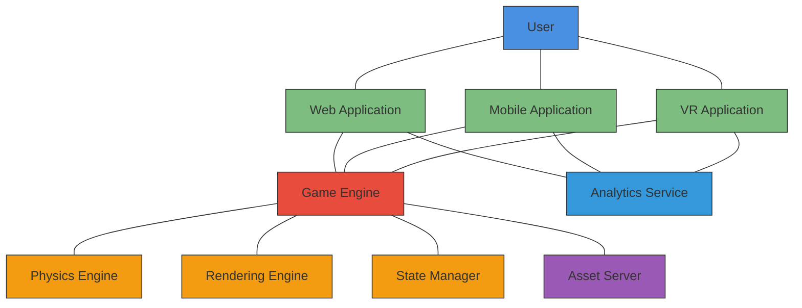

# C4 Context Diagram - Penguin Surf Game

```mermaid
graph TD
    User["User"]
    WebApp["Web Application"]
    MobileApp["Mobile Application"]
    VRApp["VR Application"]
    GameEngine["Game Engine"]
    PhysicsEngine["Physics Engine"]
    RenderingEngine["Rendering Engine"]
    StateManager["State Manager"]
    AssetServer["Asset Server"]
    Analytics["Analytics Service"]
    
    User --- WebApp
    User --- MobileApp
    User --- VRApp
    WebApp --- GameEngine
    MobileApp --- GameEngine
    VRApp --- GameEngine
    GameEngine --- PhysicsEngine
    GameEngine --- RenderingEngine
    GameEngine --- StateManager
    GameEngine --- AssetServer
    WebApp --- Analytics
    MobileApp --- Analytics
    VRApp --- Analytics
    
    style User fill:#4A90E2,stroke:#333
    style WebApp fill:#7DBE80,stroke:#333
    style MobileApp fill:#7DBE80,stroke:#333
    style VRApp fill:#7DBE80,stroke:#333
    style GameEngine fill:#E74C3C,stroke:#333
    style PhysicsEngine fill:#F39C12,stroke:#333
    style RenderingEngine fill:#F39C12,stroke:#333
    style StateManager fill:#F39C12,stroke:#333
    style AssetServer fill:#9B59B6,stroke:#333
    style Analytics fill:#3498DB,stroke:#333
```
